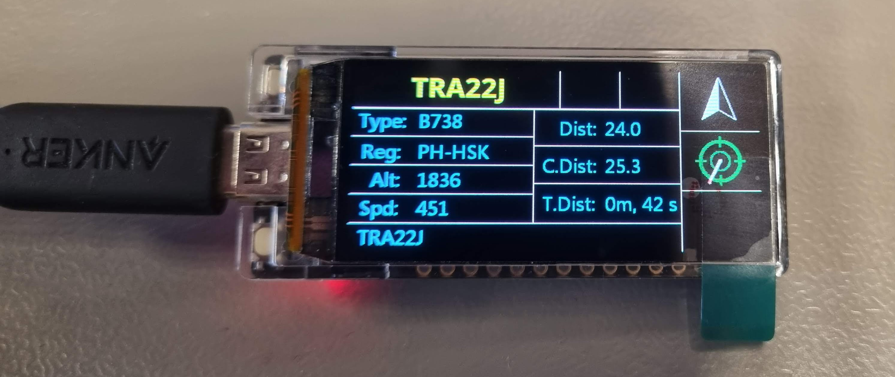

# FlightradarRadar
Interesting plane tracker based on an lilygo t-display s3 amoled

The program frequently checks airplane data in the neighbourhood and highlights interesting planes. Information about the closest plane is given on the screen. This information ranges from plane type, speed, altitude to the distance to you.
In addition, the expected closest distance is calculated (C.Dist) and the time until this closest distance is reached is shown (T.Dist).

## Features
✅ Periodically retrieves data from FlightRadar\
✅ Filters all the planes in the given area for interesting planes\
✅ Determines the closest plane at the moment\
✅ Display basic information of the plane on the screen\
✅ Calculates the predicted closest distance and time until this distance\
✅ Arrow icon indicates the direction of the plane\
✅ Radar icon indicates the where the plane is with respect to the user

## Future additions
- Integrate a compass IC to determine north, and rotate the radar respecively to it
- Create a webserver to change the list of important airplanes and user's cooridinates
- Save list of important airplanes and coordinates to flash (for persistent memory)
- Add buttons to cycle through the filtered planes
- Add icons for the differrent types of planes (like on FlightRadar)